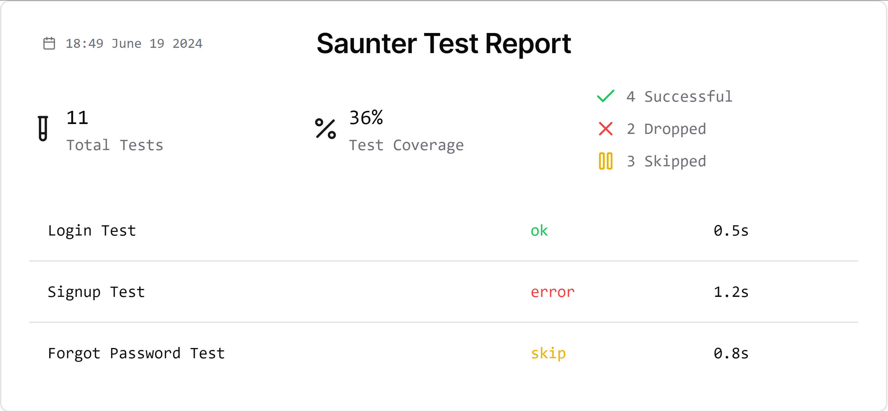

# utsukushii

> in development

## Design

Main goal:

> Convert test result into beatufy report and present it

UJ:

1) get the test report(s) in
   * format: junit, ???
   * native run: dotnet, go, cypress, ???
2) generate utusukushi content file
3) run web server with utusukushi ui with content file  



```ascii
              1. merge and group multi reports                                                
              2. history rate from multi reports                                              
              3. different output format?                                                     
                                                                                              
                              ┌───────────────────────────────────┐                           
                              │                                   │                           
  junit──────────────────────►│                                   │                           
                              │                                   │                           
                              │                                   │                           
  vstest ────────────────────►│           generator               ├───────────────────► report
                              │                                   │                           
                              │                                   │                           
..allure─────────────────────►│                                   │                           
                              │                                   │                           
                              └───────────────────────────────────┘                           

other....                                                                                       
```

## TODO

* [X] Mvp on junit single input
* [X] Go serve
* [X] Mvp on junit multi input
* [ ] Test on c#
* [ ] Test on golang
* [ ] Test on java
* [ ] Test on react
* [ ] Docs write
* [ ] github action to fmt, release
* [ ] Release v0.0.1
* [ ] github action release
