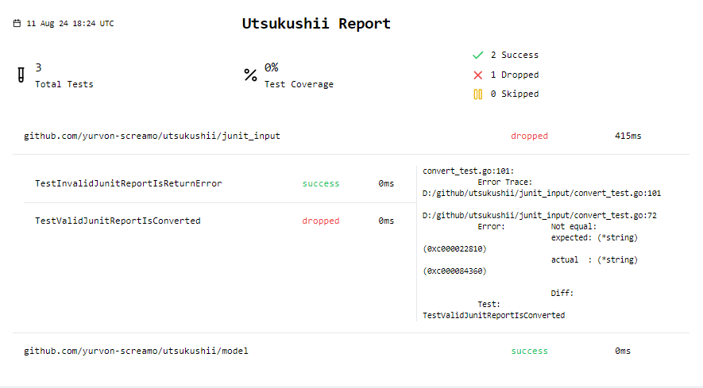

# utsukushii

A set of utilities that will allow you to create a beautiful test report for your application.

> in development



## Install

With go:

```bash
go install github.com/yurvon-screamo/utsukushii@latest
```

## Usage

## Fast start for golang test

Run test, gen content and serve:

```bash
go test -v --json ./... | utsukushii go-dev
```

### Generate content file

Take your test report(s) (now support junit and go test --json output), and generate content file:

```bash
utsukushii gen --junit ./my-junit1.xml --junit ./my-junit2.xml --go-json-test my-go-json-test-1.log --go-json-test my-go-json-test-2.log
```

if necessary add coverage, output path and report title params:

```bash
utsukushii gen --junit ./junit.xml --junit -o my-utsukushii.json -t "my report" --coverage 65
```

### Serve

Run web-ui for given content file:

```bash
utsukushii serve
```

or add addr and content path params (on default ":8080" and "utsukushii.json"):

```bash
utsukushii serve --addr :18181 --content my-utsukushii.json
```

add '--open-browser false' to disable browser opening

## Design

Main goal:

> Convert test result into beatufy report and present it

UJ:

1) get the test report(s) in
   * format: junit, ???
   * native run: dotnet, go, cypress, ???
2) generate utusukushi content file
3) run web server with utusukushi ui with content file  

```ascii
              1. merge and group multi reports                                                
              2. history rate from multi reports                                              
              3. different output format?                                                     
                                                                                              
                              ┌───────────────────────────────────┐                           
                              │                                   │                           
  junit──────────────────────►│                                   │                           
                              │                                   │                           
                              │                                   │                           
  vstest ────────────────────►│           generator               ├───────────────────► report
                              │                                   │                           
                              │                                   │                           
..allure─────────────────────►│                                   │                           
                              │                                   │                           
                              └───────────────────────────────────┘                           

other....                                                                                       
```

## TODO

* [X] Mvp on junit single input
* [X] Go serve
* [X] Mvp on junit multi input
* [X] Docs write
* [X] github action to fmt, release
* [X] Native go runner
* [ ] Native c# runner
* [ ] Release v0.0.1
* [ ] github action release
