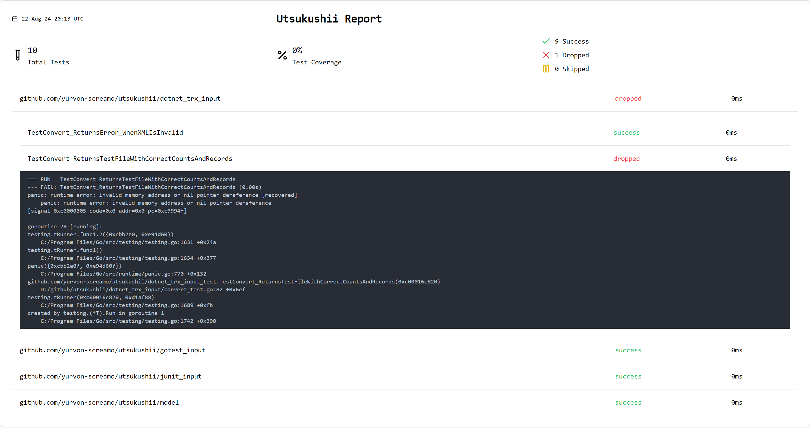
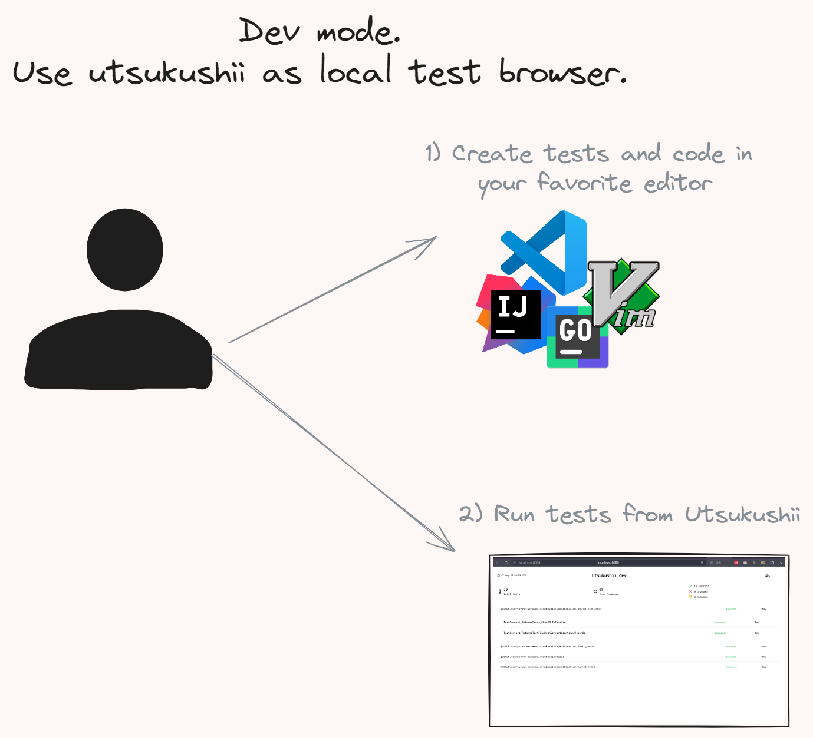
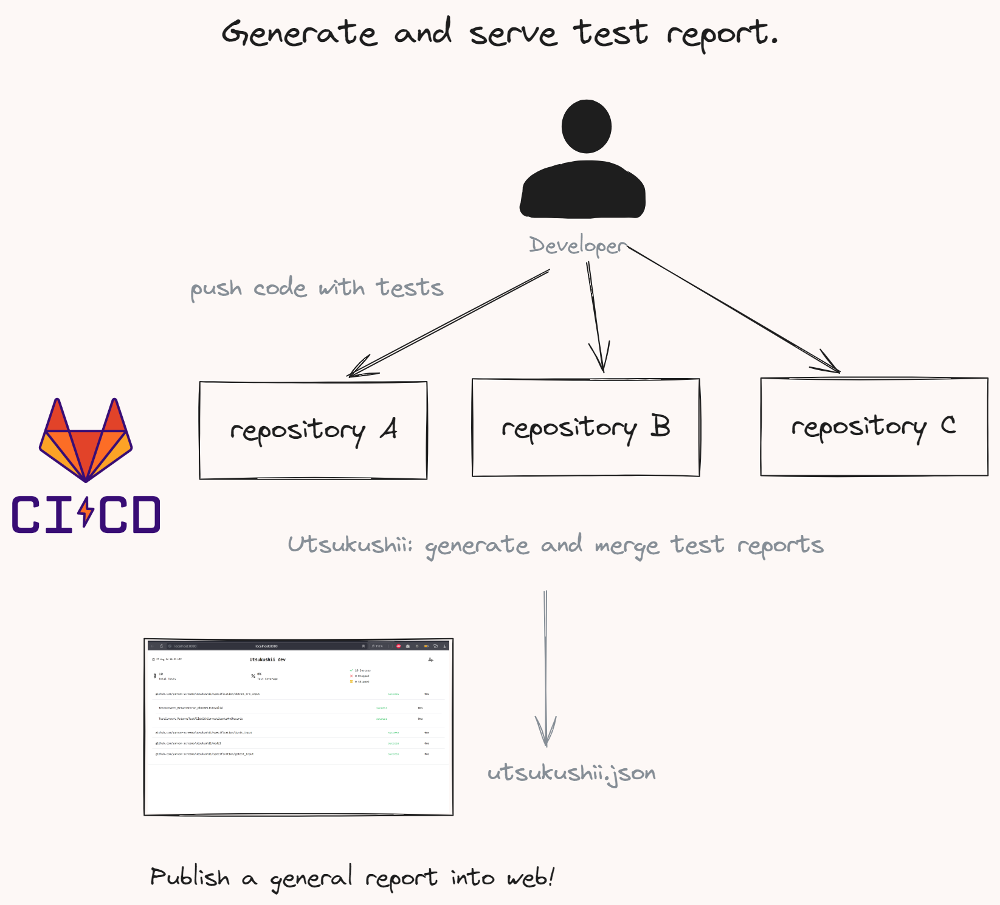

# 🌸 Utsukushii - Beautify Your Test Reports

Utsukushii is a small tool designed to transform your test reports into beautiful, easily understandable formats.

Whether your test outputs format, Utsukushii helps you present your results with clarity and style.

> 🚧 **In Development** - Contributions and feedback are welcome!



## 🚀 Features

- **Dev mode**: Run test from UI !
- **JUnit Format Support**: Convert JUnit outputs into a unified, beautiful report.
- **Dotnet trx logger Support**: Convert dotnet trx logger report into a unified, beautiful report.
- **Go-Test Format Support**: Convert Go test outputs into a unified, beautiful report.
- **Merge reports**: Union multiple reports into single.

## 📥 Installation

Install the latest version using Go:

```bash
go install github.com/yurvon-screamo/utsukushii@latest
```

## 📚 Usage

### Dev mode



1) Create config file `utsukushii-dev.yaml`:

   ```yaml
   # Required part
   # The command to run the tests 
   cmd: go test -v --json ./...
   # Your solution language, oneof - 'go', '.net' 
   lang: go

   # Optional part
   # title: my report title
   # coverage: 46
   # addr: ':8080'
   # ignore_open: true
   ```

2) Start it:

   ```bash
   utsukushii dev
   ```

### Generate and Serve Reports



1. **Generate Content**:

   ```bash
   utsukushii gen --junit ./my-junit1.xml --go-json-test my-go-json-test-1.log --dotnet-trx myTrx.trx
   ```

2. **Serve the Report**:

   ```bash
   utsukushii serve --content my-utsukushii.json
   ```

Support:

- go test json
- dotnet test trx
- junit reports

By default, the report is served at `http://localhost:8080`.

## 🛠️ Development and Design Goals

Our main goal is to convert test results into visually appealing reports. Utsukushii supports merging multiple reports, handling various formats, and presenting historical data.

## 🤝 Contributing

Contributions are welcome! Please check out the [issues](https://github.com/yurvon-screamo/utsukushii/issues) or create a new one if you have any ideas or bugs to report.

## 📝 License

This project is licensed under the MIT License.
